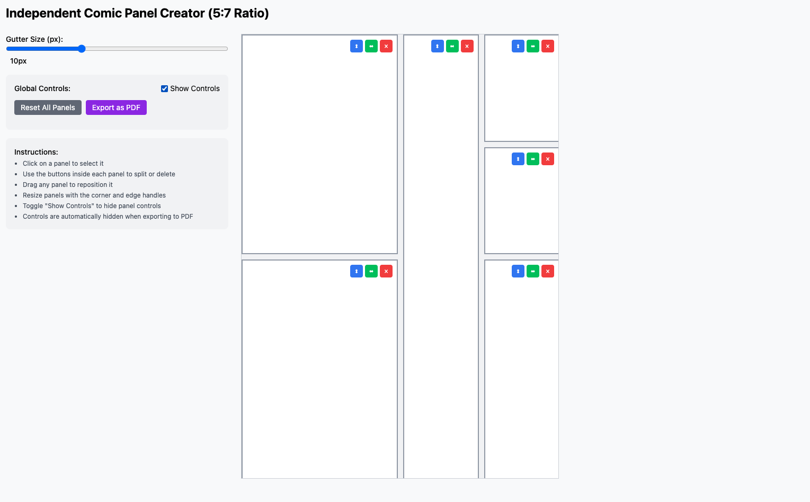
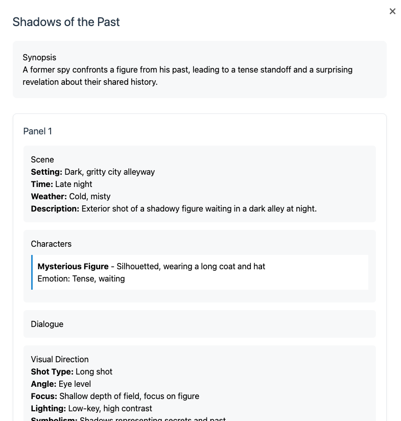

# Comic Panel Creator

A React-based tool for creating and managing comic panel layouts with an intuitive drag-and-drop interface. Create dynamic comic page layouts with customizable panels, generate AI-powered scripts based on your layout, export to PDF, and maintain precise control over your comic page design.

| Main Screenshot | Script Modal Screenshot |
| --- | --- |
|  |  |

## Features

- **AI-Powered Script Generation with Claude 3**
  - Generate complete comic scripts based on your panel layout using Anthropic's Claude 3 Opus
  - Smart interpretation of panel sizes and positions for storytelling:
    - Larger panels become dramatic moments
    - Wide panels translate to establishing shots
    - Tall panels emphasize character moments
    - Small panels suggest quick action
  - Rich script details including:
    - Scene descriptions with setting, time, and weather
    - Character profiles with age, appearance, and emotions
    - Dynamic dialogue (speech, thoughts, captions, sound effects)
    - Visual direction covering shot types, angles, lighting, and symbolism
  - View script details for individual panels with the "View Script" button
  - Optional custom Anthropic API key support with fallback to environment config

- **Dynamic Panel Management**
  - Drag and drop panels to reposition
  - Resize panels from any edge or corner
  - Maintain aspect ratios during resizing
  - Smart panel snapping and alignment
  - Automatic panel numbering that updates when panels are deleted or rearranged
  - Panel numbers displayed in the center for easy reference (hidden in exports)

- **Advanced Layout Tools**
  - Split panels horizontally or vertically
  - Automatic gutter spacing between panels
  - Adjustable gutter size for precise layout control
  - Reset layout option for quick iterations

- **High-Quality Export**
  - Export layouts to PDF or PNG format
  - Select export format with convenient radio buttons
  - High-resolution panel capture
  - Maintains panel proportions and spacing
  - Clean export without UI elements
  - Panel numbers are automatically hidden in exports
  - Improved edge handling to prevent panel cropping

- **Modern Interface**
  - Responsive design
  - Intuitive panel controls
  - Real-time layout updates
  - Clean, minimalist UI

## Getting Started

### Prerequisites

- Node.js (v14 or higher)
- npm or yarn
- Anthropic API key (can be configured in `.env` or provided through the UI)

### Installation

1. Clone the repository:
```
git clone https://github.com/MaterDev/JSReact_comic-panelist.git
cd JSReact_comic-panelist
```

2. Install dependencies:
```
npm install
```

3. Configure your Anthropic API key:
   - Create a `.env` file in the root directory
   - Add your API key: `ANTHROPIC_API_KEY=your-key-here`
   - Or provide it through the UI when generating scripts

4. Start both the client and server:
```bash
# Start the client
npm start

# In a new terminal, start the server
npm run server
```

The app will open in your default browser at [http://localhost:3000](http://localhost:3000). The server runs on port 3001 with a 120-second timeout for script generation requests.

## Usage

1. **Panel Creation and Management**
   - Start with a default panel
   - Use the resize handles to adjust panel dimensions
   - Drag panels to reposition them on the page
   - Click panel controls to split or delete panels

2. **Script Generation**
   - Create your desired panel layout - the AI will interpret panel sizes and positions for storytelling:
     - Use larger panels for important dramatic moments
     - Create wide panels for establishing shots or panoramic views
     - Design tall panels for character moments or vertical action
     - Add small panels for quick action sequences or rapid dialogue
   - (Optional) Enter your Anthropic API key in the input field
     - If not provided, the app will use the API key from your environment config
   - Click "Generate Script" to create a complete comic script
     - Please allow up to 2 minutes for the AI to analyze your layout and generate the script
   - View the generated script in a modal window, which includes:
     - Title and synopsis of the story
     - Scene descriptions with setting, time, and weather details
     - Character profiles including age, appearance, and emotional states
     - Various dialogue types (speech, thoughts, captions, sound effects)
     - Detailed visual direction covering shot types, angles, lighting, and symbolism
   - View panel-specific script details by clicking the "View Script" button on any panel
     - Each panel's script shows its specific scene details, characters, dialogue, and visual direction
     - Makes it easy to focus on individual panels while drawing or inking
   - The script is automatically structured to follow the natural flow of your panels (left-to-right, top-to-bottom)

2. **Layout Customization**
   - Adjust gutter size using the controls
   - Split panels horizontally or vertically for complex layouts
   - Reset the layout to start fresh
   - Drag panels to create dynamic arrangements

3. **Exporting Your Work**
   - Click the "Export to PDF" button
   - The layout will be captured in high resolution
   - A PDF will be generated with your panel layout
   - Download and save your work

## Built With

- **React + TypeScript** - For robust, type-safe components
- **Tailwind CSS** - For modern, responsive styling
- **Express** - For the backend server
- **Anthropic Claude API** - For AI-powered script generation
- **html2canvas** - For high-quality panel capture
- **jsPDF** - For PDF generation and export

## Available Scripts

- `npm start` - Runs the development server
- `npm run server` - Runs the backend server
- `npm run build` - Creates a production build
- `npm test` - Runs the test suite

## Contributing

Contributions are welcome! Please feel free to submit a Pull Request.

## License

This project is licensed under the MIT License.
